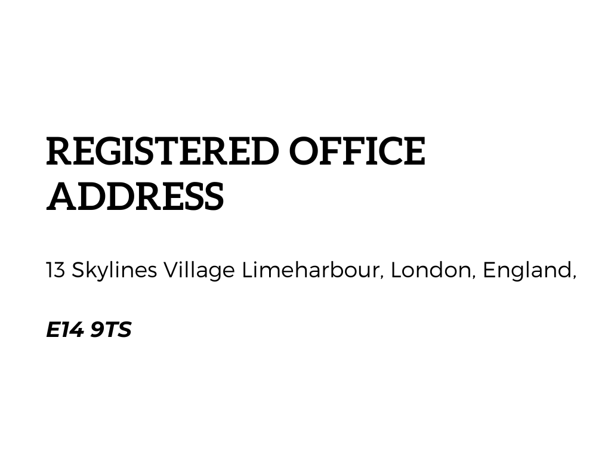

# WhiteHat 
<html lang="en">
  <head>
    <meta charset="UTF-8" />
    <title>WhiteHat: provides real-time visibility into your security status and allows you to understand the risks and vulnerabilities in your environment. This means you can take appropriate steps to fix them before any malicious actors get in! </title>
    <link href="styles.css" rel="stylesheet">
    <meta name="viewport" content="width=device-width, initial-scale=1.0">
    <meta name="description" content="Detect & Protect against vulnerabilities ">
    <meta name="keywords" content="WhiteHat, Detect & Protect against vulnerabilities ">
    <meta name="author" content="WhiteHat">

    <link rel="icon" type="image/png" sizes="32x32" href="favicon-32x32.png">
    <link rel="icon" type="image/png" sizes="16x16" href="favicon-16x16.png">
  </head>
  
  <body>
    

      
      
      
    

    

      

        <h1>White  Hat</h1>
        <h2>
          Offers a web vulnerability solution for securing your websites, web applications, and APIs. Our automated web security testing platform detects and protects against new vulnerabilities before they become an attacker’s weapon of choice.
        </h2>
      

      

        <h3>Detect & Protect against vulnerabilities including </h3>
       

        <code>- SQL injections</code>
        <code>- XSS</code>
        <code>- misconfigurations</code>
        <code>- weak passwords</code>
        <code>- exposed databases and </code>
        <code>- out-of-band vulnerabilities</code>
      

      

        <h3>Basic Usage</h3>
        <code>$ WhiteHat snap-fingers --with-glove</code>
      

      

        
        

          Contact our trusted partner,  
          sales@procomeurope.co.uk for more details 
        

      

    

  </body>
</html>

